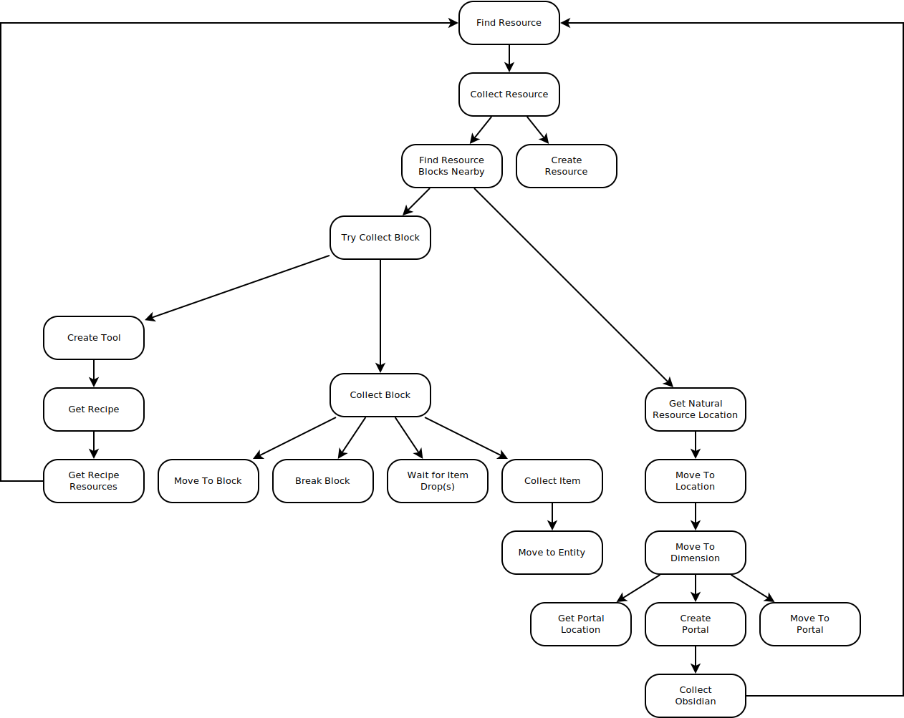

<h1 align="center">Prismarine-Gameplay Implementation Notes</h1>

The purpose of this document is to describe the detailed plans for the implementation of the <em>prismarine-gameplay</em> plugin. As there have been many different disscussions concerning how many various approachs could be made, this document provides a singular location to finalize these plans during the initial implementation process. Note that this document may change, or be removed completely at any time during the development of the plugin.

---

## Table of Contents <!-- omit in toc -->

- [1. Goals](#1-goals)
- [2. Infinite State Machine Approach](#2-infinite-state-machine-approach)
  - [2.1. Hierarchy](#21-hierarchy)
  - [2.2. Plugins](#22-plugins)
  - [2.3. Limitations](#23-limitations)
  - [2.3.1. Hard Dependencies](#231-hard-dependencies)
  - [2.3.2. Interrupting Tasks](#232-interrupting-tasks)

---

## 1. Goals

Here, the term "task" and "strategy" are used interchangeably.

The main objective of _prismarine-gameplay_ is to add a higher level API to a Mineflayer bot to remove a lot of the low-level work required to complete a task. Writing bots should be easy. There's no reason for developers to need to rewrite common tasks over and over into each bot they, or any one else, makes.

Through the usage of prismarine-gameplay, most commonly tasks can be run using a single API call without needing to specify each operation the bot would need to preform in order to complete that task. Knowledge of core gameplay elements from Minecraft should be given to the bot to allow it to decide for itself how to complete tasks. A common example of this would be asking the bot to mine diamonds. The bot should have a general understanding of where to find diamonds, how to harvest them, how to create tools in order to mine them, and how to collect resources to make those tools.

Each task should also be environmentally aware and take these aspects into consideration when attempting to preform various tasks. For example, if the bot was in the Nether, and was asked to collect diamonds, it would need to know that it needs to first travel back to the Overworld in order to begin searching for diamonds. However, if diamond blocks were manually placed around the bot while still in the Nether, it should know to try and collect these blocks first, if possible.

Lastly, it should be easy for players to define their own strategies to give to the bot in order to complete tasks in a special way that the bot might not have initially considered. For example, if the bot was asked to collect iron, it would travel into the mines to begin looking for ore. However, if a developer created a custom strategy which explained how to build and use an iron farm, the bot would take that into consideration when collecting iron.

## 2. Infinite State Machine Approach

The initial idea for approaching this goal is through the use of an infinite state machine. This approach would allow for a strategies to act as states within a state machine tree that, in tern, call other strategies as needed. By making tasks dynamically create and run other tasks while executing, the bot is able to quickly adapt to it's current situation and handle it accordingly. This situation offers a very easy approach to write new strategies for the bot to preform and allows these strategies to make use of the higher level API they are helping to create. In addition, tasks can be executed immediately on the bot without needing to preform any search algorithms or do any decision making.

### 2.1. Hierarchy

This approach relies on the ability for strategies to conditionally call other strategies based on the current needs of the bot. These needs are determined during execution and can be adapted to instantly. This also allows the bot to operate in a human-like manner, where execution information is hidden from the bot until it is ready to preform that step. This can be seen as the bot knowing it will receive ores for mining, but not knowing when or where it'll run into them.

In the image above, you can see an example of a dependency map. Each strategy/task is a node within this map. When called, it in turn may call any of it's children any number of times while executing until the task is complete. Because some strategies depend on parent strategies, (as shown by "Get Recipe Resources" depending on "Find Resource"), each node can recursively generate new tasks as needed in order to complete the given task. When a child task is finished executing, the parent task continues. Likewise, any node on this graph can be considering an entry point for the bot to preform. Each task can be executed manually by the developer using only a single API call.

The image above is just an example of what the dependency map would look like. In reality, there can be any number of strategies added to the bot and the tree would likely be significantly bigger.

It can be also seen as the dependency map being used to generate a procedural state machine based on the given requirements of the task and environment the bot is in.

For example, if we were to run the "Find Resource" strategy on the above graph, it could produce this result. This state machine is useful in allowing the bot to preform actions, dynamically adjusting to it's environment, until the given task is complete. This procedurally generated graph can be any size or complexity, expanding on itself as needed during execution.

### 2.2. Plugins

Another important factor in this approach is the ability for developers to define their own custom strategies on top of these strategies in order to create custom, more complex behavior styles and execute tasks more effectively. Plugins can be defined by simply extending a single abstract class and overriding the `run(options, cb)` function in order to define behavior styles. From inside this function, strategies can create and execute new strategy instances with custom parameters.

These plugins can be loaded into the bot by calling `bot.gameplay.addStrategy(myStrategy)`. A function call is automatically generated on the bot.gameplay object as well as proper error handling and callback wrappers for executing it safely. Generated function call is: `bot.gameplay.myStrategyName(options, cb)`

Through the use of plugins, it also becomes extremely easy to define behaviors which are specific to a specific server or custom mini game. Some servers offer virtual shops which can be used to obtain resources without needing to collect them manually. Creating a strategy which allows the bot to understand how to use the in-game shop would be useful here as it might just be significantly easier to buy a given resource rather than try and hunt down that resource manually.

### 2.3. Limitations

There are currently two major limitations exist with this dynamic state approach. Below are the limitations and proposed solutions to overcoming these limitations.

### 2.3.1. Hard Dependencies

The first major problem lies with the implementation of hard dependencies in the state machine. A strategy/plugin will always execute the same children. In closed environments, this is never an issue. However, when loading new strategies, these new strategies are never considered by the original, pre-defined strategy functions. While new strategies can always call existing strategies, existing strategies can never call new strategies.

<h4><ins><em>Solutions</em></ins></h4>

**Heuristic Based Task Selection**

The first proposed solution to this problem is to allow for existing strategies to select strategies from a list to execute. Heuristics could be used in order to determine what task would be best suited for the job at the given time. However, this raises some major questions:

1. How would we know the subtask we are executing actually solves the intended problem?

   - With hard dependencies, it becomes easy to know exactly what function would be executed for the given situation. "Collect Recipe Resources" will always call "Find Resources", meaning it's known that by the end of the task, the required resources will always be obtained if possible. Using a heuristic based implementation, the selected task may not be the type of task needed for this situation. This could lead to many problems with getting stuck or executing tasks that make no sense for the given situation.

2. How would we properly guess the heuristics for the given task?

   - Using a heuristic based approach heavily relies on heuristics to be stable enough that certain strategies are not given an unfair bias, or that heuristics are correctly estimated between two similar strategies. If one strategy determines a cost of 10 while another strategy determines a cost of 100 for the same operation, one task will _always_ be given priority over the other due to the deferences in scaling. In addition, what exactly would we be measuring? The estimated time to execute? How many actions need to be preformed? How likely a human is to preform this task in this situation? In addition, what if the heuristics are vastly different from what they should be, simply because not enough information was taken into consideration.

3. How long would it take to guess the correct task to use?

   - If it takes to long to determine the heuristics for a situation, this could vastly effect the performance of the bot, leading to noticeable stalls and poor reaction times. For extremely bad estimation times, the bot may stand idle for many seconds or even entire minutes by attempting to process too much information. Even if the heuristic estimation is simple, it could still be slowed down drastically by the number of loaded strategies being considered if many plugins are installed. Caching would be important, but would have to be handled differently for each situation. This might be tricky to implement.

4. How far ahead should we look?

   - When determining tasks to preform, it may require a much deeper search to preform in order to correctly select a task. It may look like a given task may be extremely optimal or suboptimal at first, but by searching two or three layers deep, it would become clear that the initial estimate could be completely wrong by a large margin.

5. Who is determining these heuristics?

   - When is comes to calculating the actual heuristic, who would be preforming these calculations? The base plugin? The parent strategy? The child strategy? If defined in either one, how would the correct heuristic be calculated without completely understanding the implementation of the other?

**Injection Based Task Selection**

Injection based task selection is a modification of the above heuristic-based solution which attempts to stay largely rooted in using hardcoded dependencies where practical. In this solution, each strategy can contain lists of available strategies that other strategies can use to inject themselves into. This allows for some decision making to still occur but also allows for both the parent and child tasks to understand each other's role a bit better, meaning more realistic estimations can be made for the heuristics. This still caries some of the problems over from the heuristic based solution, but makes the transition smoother by fixing issues regarding improper task selection or blind heuristic estimations. The issues for how far to look ahead and how long it would take to calculate the heuristics still exist.

While this solution fixes most of the issues from the heuristic based solution, it also proposes a new problem in which two separate plugins would not be able to see each other, meaning a bridge plugin would need to be made in those situations in order for either plugin to consider using the other plugin's strategies directly. On the flip side, both plugins could still be expecting by the default strategies without needing to know about the existence of the other, meaning that indirect communication does still exist by default.

### 2.3.2. Interrupting Tasks

There are several situations that may occur while executing tasks which require the bot to stop executing it's current task temporarily. Some common examples of these situations are being attacked by a random mob, receiving heavy damage, unexpected potion effects, or being hungry.

With the current state machine implementation, it's not directly obvious where these types of events should be handled without checking for them in every single task. This is obviously slow to execute and cumbersome for the developer making the tasks.

<h4><ins><em>Solutions</em></ins></h4>

**Pauseable/Cancelable Tasks**

By allowing tasks to be "paused" or "canceled", depending on the task, noteworthy events can send event triggers which cause the currently executing task to stop executing and generate a new temporary subtask instantly for handling the given situation. This would be implemented by the gameplay plugin itself rather than the strategy, thus all strategies would be able to preform this task at given breakpoints. After the subtask has finished executing, the original task is either resumed or restarted depending on which action it supports. If a task does not support either of these options, the bot would wait until the task is completed before handling the situation. Execution control would return to the parent task afterwards.

The implementation of this feature changes certain aspects of the design which would need to be considered while developing new strategies.

1. Child tasks many take any amount of time to finish if it is interrupted.
2. The bot may be in a completely new state after being interrupted. Changes must be checked for and handled accordingly.

In some situations, it might be simply easier for the bot to cancel the entire task tree and execute the original task again. Given that the bot may have been anywhere in the task when it's canceled, it would be imperative for the bot to regain an understanding of it's new world state and adapt accordingly to the new situation. (I.e. if already in a mineshaft, don't build a new one.) However, doing this would determined solely by the original strategy.

When executing tasks, it would also be important to send a message to all parent tasks recursively that an interruption had occurred while executing the child task so that proper state checking must be done to correct any inconsistencies.
